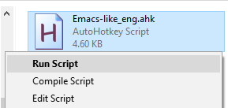

# Emacs-like (Mac-like) key-bindings on Windows using [AutoHotKey](https://www.autohotkey.com/)

## Setup 

Downnload and run [the compiled standalone version](https://github.com/usuyama/emacs-key-binding-windows/releases/tag/v0.1)

Or install [AutoHotKey](https://www.autohotkey.com/) and run the script

##### AutoHotKey icon will appear in the system tray

## Usage

The script uses CapsLock as the \<Control> modifier in Emacs. In this way, we can still use Ctrl keys for other default shortcuts e.g. Ctrl+a, Ctrl+c, and etc.

|Command | Description| Emacs defaults |
|---|---|---|
| CapsLock + a  | Go to start of the line | C-a |
| CapsLock + e  | Go to end of the line | C-e |
| CapsLock + f  | Move forward one character  | C-f |
| CapsLock + b  | Move backward one character  | C-b |
| CapsLock + n  | Move down one line  | C-n |
| CapsLock + p  | Move up one line  | C-p |
| CapsLock + Space | Ctrl + Space (PowerToys Run for Spotlight-like UX) | |

Check the .ahk script for other functionalities.

## Tested
Tested on Windows 10 + English keyboard
